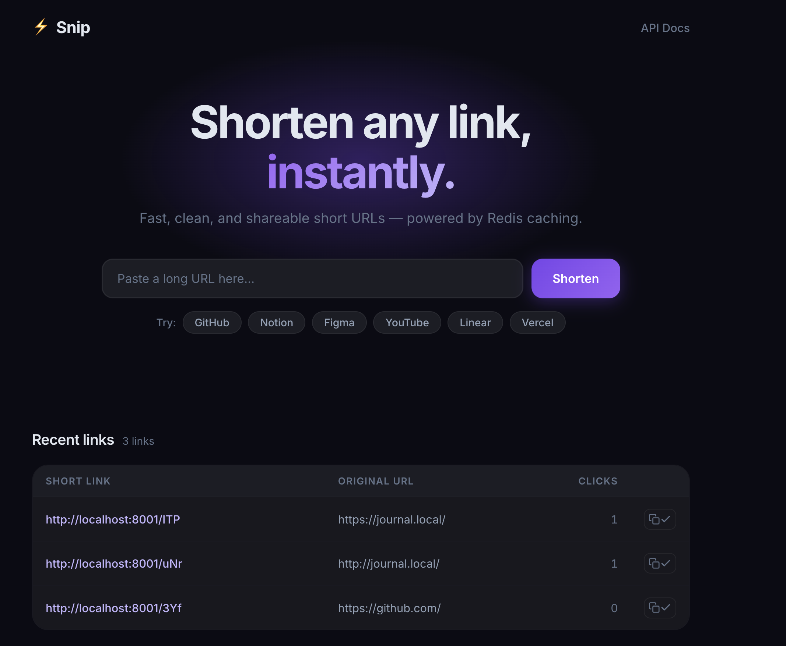

# URL Shortener

An internal URL shortener built with **FastAPI + PostgreSQL + Redis**.



## Features

- Shorten URLs with random, non-sequential short codes (base62)
- Deduplicate — same long URL always returns the same short code
- Fast redirects with Redis cache-aside pattern
- Usage tracking (clicks, referrer, user agent)
- Premium dark-themed UI with animations and suggestion chips

## Tech Stack

- **FastAPI** — async Python web framework
- **PostgreSQL** — persistent storage
- **Redis** — cache layer for fast redirects
- **Jinja2** — server-rendered templates

## Quick Start

```bash
# Install dependencies
pip install -r requirements.txt

# Configure environment
cp .env.example .env
# Edit .env with your DATABASE_URL, REDIS_URL, and BASE_URL

# Run the app
uvicorn app.main:app --reload
```

Open `http://localhost:8000` in your browser.

## Running Tests

```bash
pytest
```

## Project Structure

```
url_shortener/
├── app/
│   ├── main.py          # FastAPI app + lifespan
│   ├── config.py        # Settings from .env
│   ├── database.py      # PostgreSQL connection pool
│   ├── cache.py         # Redis cache helpers
│   ├── shortener.py     # ID generation + base62 encoding
│   ├── models.py        # Pydantic models
│   ├── routes/
│   │   ├── pages.py     # UI + redirects
│   │   └── api.py       # JSON API
│   └── templates/
│       ├── base.html
│       └── index.html
├── static/
│   ├── style.css
│   └── app.js
├── tests/
│   ├── conftest.py
│   ├── test_api.py
│   ├── test_cache.py
│   └── test_shortener.py
├── requirements.txt
└── .env.example
```
